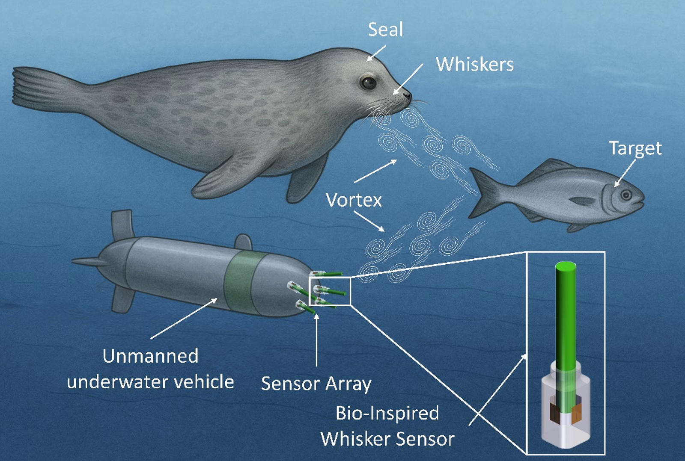
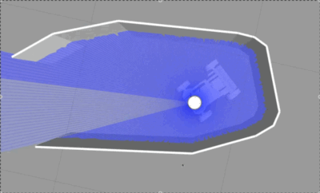
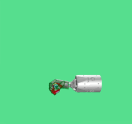

# Hi, I'm Denghan Xiong 👋

I'm an undergraduate student in Electrical Engineering at the ZJU-UIUC Institute.  
My work focuses on **robotics, control, and embodied AI**, especially integrating  
reinforcement learning with real-world robotic systems and bio-inspired sensors.

### 🔬 Research Interests
- Reinforcement Learning for robotic control  
- Dexterous manipulation (Shadow Hand)  
- Nonholonomic robot navigation & cul-de-sac escape  
- Bio-inspired underwater whisker sensors  
- Embodied AI / humanoid robotics

## 🚀 Projects

---

### 1. Bio-Inspired Underwater Whisker Sensor
Bio-inspired PDMS + silicon-gauge whisker sensor for underwater flow sensing under turbidity and darkness.

**📄 Paper:**  
[A Bio-Inspired Whisker Sensor toward Underwater Flow Sensing in Darkness and Turbidity](https://arxiv.org/abs/2511.22353)

**🖼️ Image:**  

---

### 2. Dead-End Escape with Deep Reinforcement Learning
A deep RL controller that enables a nonholonomic car-like robot to escape narrow cul-de-sacs using forward–reverse maneuver sequencing.

**📄 Paper:**  
[Nonholonomic Narrow Dead-End Escape with Deep RL](https://arxiv.org/abs/2511.22338)

### Dead-End Escape Demo

---

### 3. Dexterous Manipulation with Shadow Hand (PPO)
Training a 24-DoF Shadow Dexterous Hand using PPO for grasping and in-hand manipulation.

### Shadow Hand PPO Demo

### 📫 Contact
- Email: denghan2@illinois.edu / denghan.22@intl.zju.edu.cn  

Thanks for visiting my page!  
