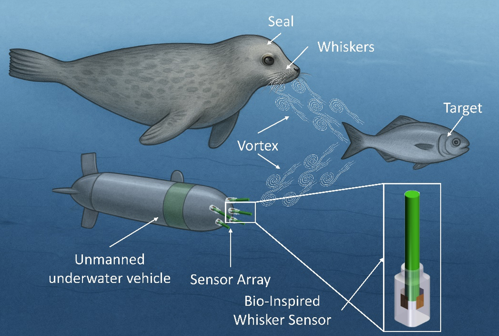
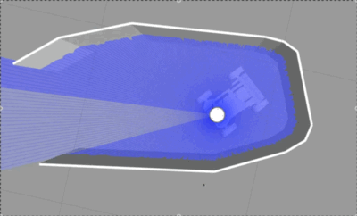
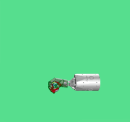
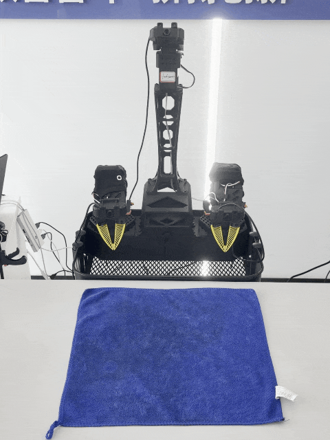
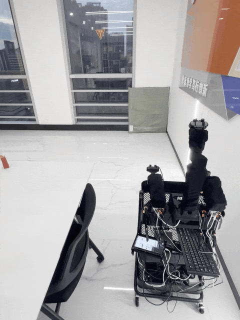
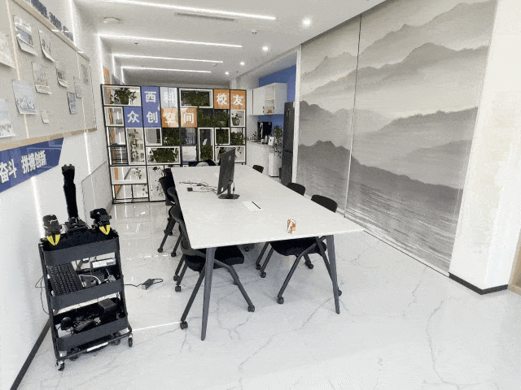

# Hi, I'm Denghan Xiong 👋

I'm an graduate student in Electrical and Computer Engineering at the UIUC.  
My work focuses on **robotics, control, and embodied AI**, especially integrating  
reinforcement learning with real-world robotic systems and bio-inspired sensors.

### 🔬 Research Interests
- Reinforcement Learning for robotic control  
- Dexterous manipulation (Shadow Hand)  
- Nonholonomic robot navigation & cul-de-sac escape  
- Bio-inspired underwater whisker sensors  
- Embodied AI / humanoid robotics

## 🚀 Projects

---

### 1. Bio-Inspired Underwater Whisker Sensor
Bio-inspired PDMS + silicon-gauge whisker sensor for underwater flow sensing under turbidity and darkness.

## 🔗 Related Repositories
- [mlp-final-paper-code](https://github.com/denghan1106/mlp-final-paper-code)

**📄 Paper:**  
[A Bio-Inspired Whisker Sensor toward Underwater Flow Sensing in Darkness and Turbidity](https://doi.org/10.1109/ASIM67379.2025.11512830)

**🖼️ Image:**  

---

### 2. Dead-End Escape with Deep Reinforcement Learning
A deep RL controller that enables a nonholonomic car-like robot to escape narrow cul-de-sacs using forward–reverse maneuver sequencing.
## 🔗 Related Repositories
- [cisDRL-robotnav](https://github.com/gitagitty/cisDRL-robotnav)

**📄 Paper:**  
[Nonholonomic Narrow Dead-End Escape with Deep RL](https://doi.org/10.1145/3788149.3788204)

### Dead-End Escape Demo

---

### 3. Dexterous Manipulation with Shadow Hand (PPO)
Training a 24-DoF Shadow Dexterous Hand using PPO for grasping and in-hand manipulation.
## 🔗 Related Repositories
- [Gym-Robo](https://github.com/denghan1106/gym-robo)

### Shadow Hand PPO Demo

### 4. XLeRobot: Mobile Manipulation with LeRobot

A real-world robotics project built on LeRobot/XLeRobot, integrating
custom hardware interfaces, ROS 2 navigation, vision-guided approach,
and local agent orchestration.

**Code:** [xlerobot_lerobot](https://github.com/denghan1106/xlerobot_lerobot)

<table>
  <tr>
    <th>Towel Folding</th>
    <th>Full Workflow · View 1</th>
    <th>Full Workflow · View 2</th>
  </tr>
  <tr>
    <td align="center" valign="top">
      
    </td>
    <td align="center" valign="top">
      
    </td>
    <td align="center" valign="top">
      
    </td>
  </tr>
</table>

---

### 📫 Contact
- Email: denghan2@illinois.edu

Thanks for visiting my page!  
